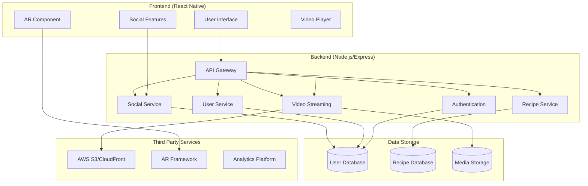

# Locked and Cocked-Tails Architecture

```mermaid
flowchart TD
    subgraph Frontend["Frontend (React Native)"]
        UI[User Interface]
        AR[AR Component]
        Video[Video Player]
        Social[Social Features]
    end

    subgraph Backend["Backend (Node.js/Express)"]
        API[API Gateway]
        Auth[Authentication]
        RecipeService[Recipe Service]
        UserService[User Service]
        SocialService[Social Service]
        VideoService[Video Streaming]
    end

    subgraph Database["Data Storage"]
        UserDB[(User Database)]
        RecipeDB[(Recipe Database)]
        MediaDB[(Media Storage)]
    end

    subgraph ThirdParty["Third Party Services"]
        AWS[AWS S3/CloudFront]
        ARKit[AR Framework]
        Analytics[Analytics Platform]
    end

    UI --> API
    AR --> ARKit
    Video --> VideoService
    Social --> SocialService

    API --> Auth
    API --> RecipeService
    API --> UserService
    API --> SocialService
    API --> VideoService

    Auth --> UserDB
    RecipeService --> RecipeDB
    UserService --> UserDB
    SocialService --> UserDB
    VideoService --> MediaDB
    VideoService --> AWS
```
